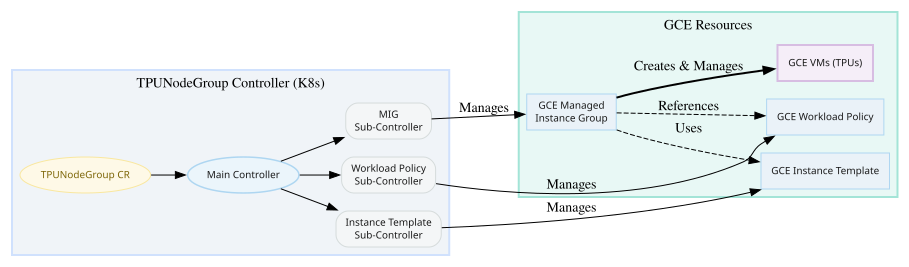
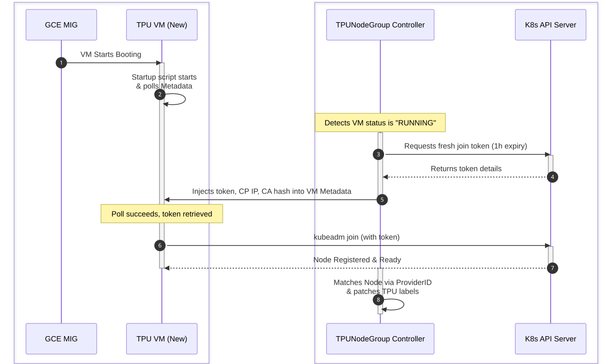

# tpu-operator

A Kubernetes operator designed to automate the lifecycle of TPU slices within self-managed clusters on Google Compute Engine (GCE).

## Overview: What the Controller Does for You

When running self-managed Kubernetes on Google Compute Engine (GCE), provisioning TPU slices manually requires orchestrating multiple GCE APIs, managing complex metadata for hardware discovery, and bootstrapping nodes.

The TPUNodeGroup controller acts as a Kubernetes-native infrastructure operator that automates the complexities of provisioning TPU slices. Unlike standard GCE VMs, TPU slices involve multiple VMs interconnected with a specialized high-speed network, forming a single, atomic unit for large scale ML workloads.

From your perspective, you simply provide a TPUNodeGroup CR declaring your desired TPU shape. Behind the scenes, the controller will:

1. Abstract GCE Complexity: To properly provision TPUs, the controller automatically creates three critical GCE resources on your behalf:
   * GCE Workload Policy: Responsible for specifying the physical properties of the underlying infrastructure. For multi-host slices, this policy specifies the acceleratorTopology (e.g., 4x4x4), which tells Google's data centers exactly how to physically wire the TPU chips together using high-speed Inter-Chip Interconnects (ICI).
   * Instance Template: Defines the VM configuration (machine type, image, disks, metadata, etc.) used by the Managed Instance Group.
   * Managed Instance Group (MIG): Responsible for actually provisioning and managing the lifecycle of the Virtual Machines. For multi-host slices, users must explicitly configure `targetSizePolicyMode: "BULK"` in the TPUNodeGroup CR. The controller then configures the MIG to use "bulk mode", which guarantees atomic provisioning. This ensures GCE will only create the VMs if it can successfully allocate the entire slice at once, preventing partial, unusable setups.
2. Inject TPU Metadata: Automatically inject TPU configuration metadata needed by the TPU Device Plugin (like kube-labels and accelerator\_topology\_id) into the VMs via the MIG.
3. Secure "Pull-Model" Bootstrapping: To handle long GCE provisioning times (where standard short-lived kubeadm tokens might expire), the controller implements a **Pull Model**. Instead of injecting tokens at VM creation, the controller waits for the VM state to be `RUNNING`, then injects a dynamic, short-lived join token into Instance Metadata. A startup script on the VM polls for this token, ensuring a secure and reliable cluster join even after extended provisioning delays. (Note: This feature is primarily provided to facilitate rapid prototyping and testing. For production environments, it is expected that users will leverage their existing mechanisms for node bootstrapping, such as custom OS images or configuration management tools).
4. Deploy the TPU Device Plugin: The controller automatically deploys a streamlined, open-source TPU device plugin to your cluster as a DaemonSet. This plugin acts as the bridge between the raw TPU hardware and the Kubernetes scheduler. It discovers the attached TPU chips, registers them as schedulable resources (e.g., google.com/tpu), and handles local hardware health monitoring.
5. Handle Graceful Teardown: When the TPUNodeGroup CR is deleted, the controller orchestrates a graceful teardown using a Kubernetes Finalizer. It cordons the nodes, deletes the GCE resources (MIG, Instance Template, and Workload Policy) in reverse order, and removes stale Node objects from the cluster.

*Note: The current release supports v6e and v7x TPU generations.*

---

## Design Philosophy: Reference Bootstrapping

This project is intended as a **Reference Implementation** for experimental and testing purposes. 

**Core Assumption:** We assume that production customers already have mature solutions for their node infrastructure and lifecycle. For those who need a rapid, "turn-key" way to experiment with TPUs on self-managed clusters, we provide a **Reference Bootstrapping** flow using standard Kubernetes mechanics.

## Architecture: The Composite Pattern

This controller is designed using the **Composite Pattern** to maximize modularity and reusability. Instead of a single monolithic state machine, the project is structured as a parent controller that orchestrates three dedicated child Custom Resources:

*   **ResourcePolicy Controller:** Manages GCE Resource Policies (Workload Policies) for ICI networking.
*   **InstanceTemplate Controller:** Manages GCE Instance Templates.
*   **ManagedInstanceGroup Controller:** Manages GCE MIGs, with specific support for bulk allocation.

All infrastructure resources are managed asynchronously via official **Google Cloud Go Client Libraries**. This architecture allows the `TPUNodeGroup` controller to focus solely on high-level workload orchestration and node lifecycle, leaving the low-level GCE "3C" (Compute) resource management to specialized, decoupled sub-controllers.



### The Join-to-Workload Lifecycle (Pull-Model Bootstrapping)

When `bootstrapKubernetes` is enabled, the controller orchestrates a secure, asynchronous **Pull-Model Bootstrapping** flow. This design safely coordinates dynamic token generation and join operations over potentially extended GCE VM booting delays.

The configuration sequence proceeds as follows:

1. **GCE VM Initialization (VM Starts Booting):** The Managed Instance Group (MIG) provisions the VM.
2. **GCE VM (Polling Begins):** The VM's startup script immediately begins polling its own GCE Instance Metadata for the `kubeadm-join-token`.
3. **Controller (RUNNING Detection):** In parallel, the controller detects that the GCE VM state has transitioned to `RUNNING`.
4. **Controller (Token Generation):** The controller generates a unique, short-lived `kubeadm` join token (valid for 1 hour) and creates a corresponding **Bootstrap Secret** in the `kube-system` namespace.
5. **Controller (Metadata Injection):** The controller fetches the cluster's **CA Cert Hash** and injects it along with the **Join Token** and **Control Plane IP** directly into the GCE Instance Metadata for that specific VM.
6. **GCE VM (Poll Succeeds):** The VM's polling loop succeeds and retrieves the injected configuration values.
7. **GCE VM (Pull-Model Join):** The VM executes `kubeadm join` using the retrieved credentials to securely attach itself to the cluster.
8. **Kubernetes (Node Registered):** The K8s API Server registers the node and marks it as `Ready`.
9. **Controller (Node Matching & Labeling):** Once the new worker node appears in the cluster, the controller matches it to the GCE instance using the node's **`ProviderID`** and automatically **patches the Node with TPU labels** (topology, accelerator type, chip count).

The following sequence diagram visualizes this chronological pull-model orchestration:



---

## Prerequisites

### Configure GCP IAM Permissions

The TPUNodeGroup controller requires permissions to create and manage GCE resources (Instance Templates, Workload Policies, and MIGs) on your behalf.

You can assign the roles/compute.admin role, or for least-privilege environments, ensure the service account has the following specific permissions:

* compute.instanceTemplates.\*
* compute.resourcePolicies.\*
* compute.instanceGroupManagers.\*
* compute.instanceGroups.\*
* compute.instances.\*
* compute.subnetworks.get

### Set Up Kubernetes Control Plane (GCE VM)

If you are setting up a new self-managed cluster, you can initialize a control plane on a GCE VM using `kubeadm`.

1. **Create a GCE VM** (if you don't have one):

```shell
export ZONE=us-central1-c
export SERVICE_ACCOUNT_EMAIL=your-service-account@project.iam.gserviceaccount.com

gcloud compute instances create k8s-control-plane \
    --zone=$ZONE \
    --machine-type=e2-standard-4 \
    --image-family=ubuntu-2404-lts-amd64 \
    --image-project=ubuntu-os-cloud \
    --tags=k8s-control-plane \
    --service-account=$SERVICE_ACCOUNT_EMAIL \
    --scopes=https://www.googleapis.com/auth/cloud-platform
```

2. **Initialize the cluster**: SSH into the VM and run the following commands.
   Ensure `conntrack`, `containerd`, `kubeadm` and a CNI plugin are installed.

```shell
# Initialize the control plane with a specific pod CIDR (Flannel requires 10.244.0.0/16)
sudo kubeadm init --pod-network-cidr=10.244.0.0/16
```

Note: kubeadm is required if enabling `bootstrapKubernetes` in the TPUNodeGroup CR.

### Configure Your Subnet

Ensure your subnet has internet access (e.g., via Cloud NAT) so nodes can download packages during bootstrapping.

### Configure VPC Firewall Rules

Allow API Server access (TCP 6443\) from the TPU nodes and allow internal traffic between the Control Plane and the TPU VMs. Adjust the source-ranges to match your VPC CIDR:

```shell
export VPC_NETWORK=default
export CONTROL_PLANE_CIDR=0.0.0.0/0 # Restrict this in production
export CLUSTER_CIDR=10.128.0.0/9 # Adjust to your VPC CIDR

# Allow API Server access (6443)
gcloud compute firewall-rules create allow-k8s-apiserver \
    --allow tcp:6443 \
    --network=$VPC_NETWORK \
    --source-ranges=$CONTROL_PLANE_CIDR \
    --target-tags=k8s-control-plane

# Allow all internal traffic between nodes (Control Plane <-> TPU VM)
gcloud compute firewall-rules create allow-k8s-internal \
    --allow tcp,udp,icmp,ipip \
    --network=$VPC_NETWORK \
    --source-ranges=$CLUSTER_CIDR \
    --target-tags=k8s-control-plane
```

### Create Your TPU Reservation (Optional)

If you are using a reservation-bound provisioning model, you must reserve the TPU capacity in your target zone.

```shell
export RESERVATION_NAME=my-tpu-reservation
export VM_FAMILY=tpu7x # or tpu6e
export ACCELERATOR_COUNT=4
export HOST_COUNT=2
export ZONE=us-central1-c

gcloud compute reservations create $RESERVATION_NAME \
    --vm-family=$VM_FAMILY \
    --accelerator-count=$ACCELERATOR_COUNT \
    --host-count=$HOST_COUNT \
    --zone=$ZONE
```

##

## Step 1: Build and Deploy the Controller

Before creating the TPUNodeGroup resource, you need to build the controller image, push it to your container registry, and deploy it using the provided manifests.

1. Build and Push the Image:

```shell
export PROJECT_ID=your-project-id

docker build -t gcr.io/$PROJECT_ID/tpunodegroup-controller:latest .
docker push gcr.io/$PROJECT_ID/tpunodegroup-controller:latest
```

2. Update the Deployment Manifest: Open `deploy/kustomization.yaml` and update the `newName` and `newTag` under the `images` section to match the image you just pushed.
3. Install Components: Apply the kustomization to deploy all components (CRDs, Controller, Device Plugin, etc.).

```shell
kubectl apply -k deploy/
```

4. Verify the Controller is Running:

```shell
kubectl get pods -n tpu-node-group
```

*Note: If you are running a single-node cluster (control plane only), you may need to untaint the node to allow the controller to run: `kubectl taint nodes --all node-role.kubernetes.io/control-plane-`*

## Step 2: Create the TPUNodeGroup CR

Once the controller is running, create a TPUNodeGroup resource in your cluster. This tells the controller what capacity and configuration to instantiate.

The controller manages the creation of the Instance Template dynamically based on the `instanceConfig` fields. The `bootstrapKubernetes` block instructs the controller to automatically bootstrap the Kubernetes nodes and join them to the control plane.

Set the required environment variables:

```shell
export PROJECT=my-gcp-project
export ZONE=us-central1-c
export RESERVATION_NAME=my-tpu-reservation
export IMAGE=projects/ubuntu-os-accelerator-images/global/images/family/ubuntu-accel-2404-amd64-tpu-tpu7x
export TOPOLOGY=2x2x2
export NODE_COUNT=2
export CONTROL_PLANE_IP=10.128.0.2
export TPU_NODE_GROUP_NAME=my-tpu-node-group
export NAMESPACE=default
export ACCELERATOR=tpu7x
export MACHINE_TYPE=tpu7x-standard-4t
```

Example CR creation using these variables:

```shell
cat <<EOF | kubectl apply -f -
apiVersion: tpu.google.com/v1alpha1
kind: TPUNodeGroup
metadata:
  name: $TPU_NODE_GROUP_NAME
  namespace: $NAMESPACE
spec:
  project: $PROJECT
  nodeLocation: $ZONE
  nodeCount: $NODE_COUNT
  acceleratorConnectionMode: "STATIC"
  topology: $TOPOLOGY
  targetSizePolicyMode: "BULK" # Required in latest versions
  instanceConfig:
    machineType: $MACHINE_TYPE
    provisioningModel: "RESERVATION_BOUND"
    reservation: $RESERVATION_NAME
    image: $IMAGE
    subnetwork: projects/$PROJECT/regions/us-central1/subnetworks/default # Required if network is in custom mode
    bootDiskSizeGB: 100
  bootstrapKubernetes:
    version: "1.31"
    controlPlaneIP: $CONTROL_PLANE_IP
EOF
```

### Bring Your Own Instance Template (Optional)

If you want to further customize the VM, you can bring your own pre-provisioned GCE Instance Template and bypass the controller's template creation process. You can provide its URI using the `instanceTemplateURI` field. When this field is set, the controller will skip generating an Instance Template and use yours directly to create the Managed Instance Group. The controller will perform basic validation.

*Note: Because the controller skips the bootstrapping phase when using a custom Instance Template, you must configure your own bootstrapping solution. When doing so, you must ensure that your K8s Node objects are bootstrapped with a `spec.providerID` that matches the standard GCE instance format (`gce://<project>/<zone>/<instance-name>`). The controller relies on this `providerID` to correctly identify, match, and label the nodes as they join the cluster. Once matched, the controller will automatically perform node labeling and deploy the TPU device plugin DaemonSet.*

## Step 3: Monitor Provisioning Status

The controller provides real-time readiness feedback in the CRD status. You don't need to check the GCP console; simply inspect the resource in Kubernetes to see its exact lifecycle state.

```shell
kubectl get tpunodegroup $TPU_NODE_GROUP_NAME -o yaml
```

You can view the detailed conditions array to see the health and provisioning phase of your TPU capacity. The conditions dynamically adapt based on your configuration:

* Ready: Set to True only when 100% of the nodes in the slice are healthy, registered, and their ICI links are established.

## Step 4: Schedule Your Workloads

In your workload manifest, you can add Kubernetes node selectors to ensure that your TPU workload is scheduled on the correct TPU machine type and topology. The controller automatically injects these labels into the nodes.

*Note: For JAX workloads, please ensure you use JAX 0.10.0 or newer to avoid the need for manual worker network endpoint metadata configuration.*

Example deployment using node selectors:

```shell
cat <<EOF | kubectl apply -f -
apiVersion: v1
kind: Service
metadata:
  name: tpu-svc-v7x
  namespace: $NAMESPACE
spec:
  clusterIP: None
  publishNotReadyAddresses: true
  selector:
    app: tpu-worker-v7x
  ports:
  - name: coordinator
    port: 1234
  - name: runtime-1
    port: 8470
  - name: runtime-2
    port: 8471
---
apiVersion: apps/v1
kind: StatefulSet
metadata:
  name: tpu-worker-v7x
  namespace: $NAMESPACE
spec:
  serviceName: "tpu-svc-v7x"
  replicas: 2
  podManagementPolicy: Parallel
  selector:
    matchLabels:
      app: tpu-worker-v7x
  template:
    metadata:
      labels:
        app: tpu-worker-v7x
    spec:
      hostNetwork: true
      dnsPolicy: ClusterFirstWithHostNet
      nodeSelector:
        cloud.google.com/tpu-node-group: $NAMESPACE-$TPU_NODE_GROUP_NAME
        cloud.google.com/gke-tpu-topology: $TOPOLOGY
        cloud.google.com/gke-tpu-accelerator: $ACCELERATOR
      tolerations:
      - key: "google.com/tpu"
        operator: "Exists"
        effect: "NoSchedule"
      containers:
      - name: tpu-job
        image: us-docker.pkg.dev/cloud-tpu-images/jax-ai-image/tpu:latest
        securityContext:
          privileged: true
        command:
        - python3
        - -c
        - |
          import jax, os, time, socket

          def wait_for_dns(hostname):
              for _ in range(30):
                  try:
                      socket.gethostbyname(hostname)
                      return True
                  except socket.gaierror:
                      time.sleep(5)
              return False

          svc_name = "tpu-svc-v7x"
          pod_base_name = "tpu-worker-v7x"
          namespace = "default"

          dns0 = f"{pod_base_name}-0.{svc_name}.{namespace}.svc.cluster.local"
          dns1 = f"{pod_base_name}-1.{svc_name}.{namespace}.svc.cluster.local"

          if not wait_for_dns(dns0) or not wait_for_dns(dns1):
              print("Failed to resolve DNS for TPU workers")
              exit(1)

          os.environ.update({
              "JAX_COORDINATOR_ADDRESS": f"{dns0}:1234",
              "MEGASCALE_COORDINATOR_ADDRESS": f"{dns0}:8471",
              "TPU_PROCESS_ADDRESSES": f"{dns0}:8470,{dns1}:8470",
              "TPU_WORKER_HOSTNAMES": f"{dns0}:8471,{dns1}:8471"
          })

          p_id = int(os.environ["K8S_POD_NAME"].split("-")[-1])

          print(f"Initializing JAX distributed: coordinator={dns0}:1234, total_processes=2, process_id={p_id}")
          jax.distributed.initialize(coordinator_address=f"{dns0}:1234", num_processes=2, process_id=p_id)

          print("Devices:", jax.devices())
          assert len(jax.devices()) == 8, f"Expected 8 devices, got {len(jax.devices())}"
          print("TPU OK")

        env:
        - name: JAX_PLATFORMS
          value: "tpu"
        - name: JAX_PROCESS_COUNT
          value: "2"
        - name: TPU_TOPOLOGY
          value: "$TOPOLOGY"
        - name: TPU_ACCELERATOR_TYPE
          value: "tpu7x-4"
        - name: K8S_POD_NAME
          valueFrom:
            fieldRef:
              fieldPath: metadata.name
        - name: NODE_IP
          valueFrom:
            fieldRef:
              fieldPath: status.hostIP
        - name: TPU_CHIPS_PER_HOST_BOUNDS
          value: "2,2,1"
        - name: TPU_HOST_BOUNDS
          value: "1,1,2"
        - name: VBAR_CONTROL_SERVICE_URL
          value: "127.0.0.1:8353"
        - name: TPU_PROCESS_PORT
          value: "8470"
        - name: TPU_RUNTIME_METRICS_PORTS
          value: "8431,8432,8433,8434"
        resources:
          limits:
            google.com/tpu: "4"
          requests:
            google.com/tpu: "4"
EOF
```

## Step 5: Teardown

After the job is done, you can clean up the resources using

```shell
kubectl delete tpunodegroup $TPU_NODE_GROUP_NAME
```

The controller orchestrates a graceful teardown using a Kubernetes Finalizer. It executes the teardown in three strict phases:

1. Cordon: Marks all nodes in the slice as Unschedulable to prevent the scheduler from placing new Pods on them.
2. Infrastructure Removal: Deletes GCE resources (MIGs, Instance Templates and Workload Policies) in reverse creation order.
3. Kubernetes Cleanup: Deletes any remaining stale Node objects from the cluster and finally removes the finalizer, allowing the CR to be fully removed from Kubernetes.

---

## Using a GCP Service Account for the Controller

The TPUNodeGroup controller needs GCP permissions to create and manage GCE resources. You can provide these credentials in two ways:

### Option 1: VM Attached Service Account

If your Kubernetes control plane or operator is running on a GCE VM, the controller transparently uses the VM's attached service account via **Application Default Credentials (ADC)**. This is the recommended approach for development within GCE, leveraging the existing node identity and predefined IAM scopes for GCE worker nodes.

1. Ensure the GCE VM was created with the required IAM permissions (or `roles/compute.admin`).
2. Ensure the VM has the `https://www.googleapis.com/auth/cloud-platform` scope enabled.

### Option 2: Service Account Key File

If you are running the controller outside of GCE or want to use a specific service account, you can provide a key file via a Kubernetes Secret.

1. **Create a Service Account** in GCP and grant it the required permissions (see Prerequisites).
2. **Generate a JSON key** for the service account.
3. **Create a Kubernetes Secret** in the `tpu-node-group` namespace:

```shell
export KEY_PATH=/path/to/your/service-account-key.json

kubectl create secret generic tpu-node-group-credentials \
    --from-file=key.json=$KEY_PATH \
    --namespace tpu-node-group
```

4. **Update `deploy/controller/deployment.yaml`**: Uncomment the `env` section for `GOOGLE_APPLICATION_CREDENTIALS` in the controller deployment:

```yaml
        env:
        - name: GOOGLE_APPLICATION_CREDENTIALS
          value: /etc/gcp/key.json
```


## Contributing

This project is licensed under the [Apache 2.0 License](LICENSE).

We welcome contributions! Please see [docs/contributing.md](docs/contributing.md) for more information.

We follow [Google's Open Source Community Guidelines](https://opensource.google.com/conduct/).

## Disclaimer

This is not an officially supported Google product.

This project is not eligible for the Google Open Source Software Vulnerability Rewards Program.
