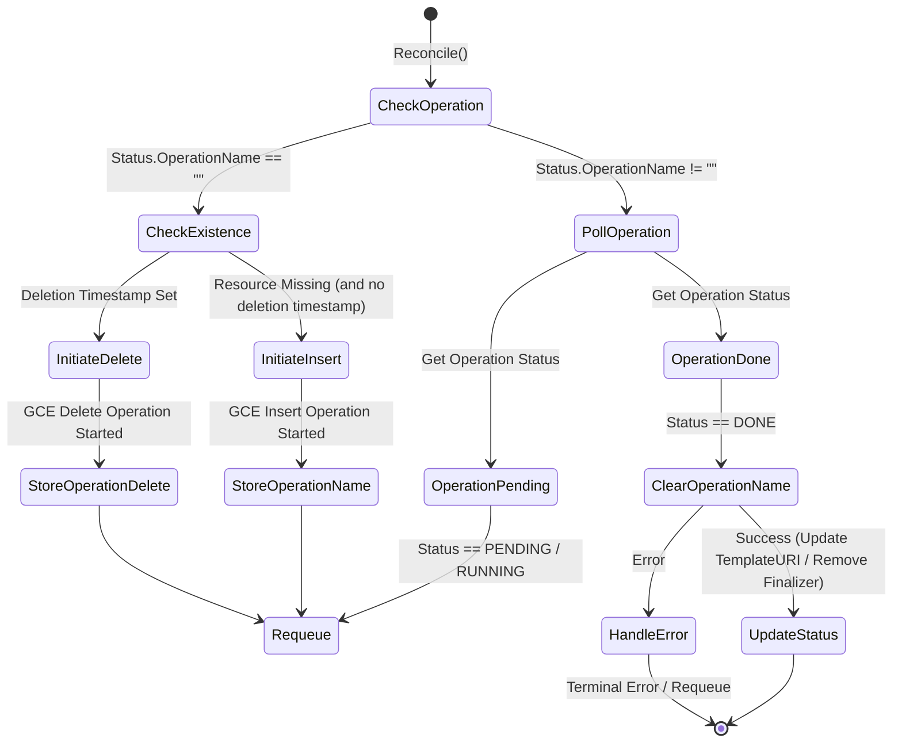

# InstanceTemplate Controller (Lower Layer Provisioner)

## Context & Purpose
*   **Role:** Low-level GCE infrastructure provisioner in the Composite Pattern (translates `InstanceTemplate` CR -> GCE Resource). Focuses strictly on TPU-required fields.

## Core Behaviors
*   **Field Mapping:** Deterministically converts `InstanceConfig` -> `computepb.InstanceTemplate`.
*   **TPU Constraints:** Forces `Scheduling.OnHostMaintenance = TERMINATE` (no live migration).
*   **Affinity:** Configures explicit reservation consumption if specified.
*   **Non-Blocking Reconciliation:** Utilizes asynchronous polling for GCE operations. When an operation (insert/delete) is initiated, its name is stored in `Status.OperationName` and the controller requeues, preventing worker thread exhaustion.
*   **Lifecycle:** Finalizer ensures GCE resource deletion before CR removal (404s ignored during teardown). Deletion is also non-blocking, tracking the GCE deletion operation asynchronously.

## Non-Blocking Execution Flow

## Orchestration & Dependencies
*   **Parent (`TPUNodeGroup`):** Owns this CR, translates user intent, and bubbles up readiness/errors. *Note: Exact condition structure (dedicated `InstanceTemplateReady` vs single `Ready` condition) is pending design finalization.*
*   **Sibling (`ResourcePolicy`):** Created parallel to or after `ResourcePolicy` (coordinated by Parent).
*   **Sibling (`ManagedInstanceGroup`):** **CRITICAL DEPENDENCY.** MIG references template URL. 
    *   *Creation:* Template MUST exist before MIG.
    *   *Deletion:* MIG MUST be deleted before Template.
